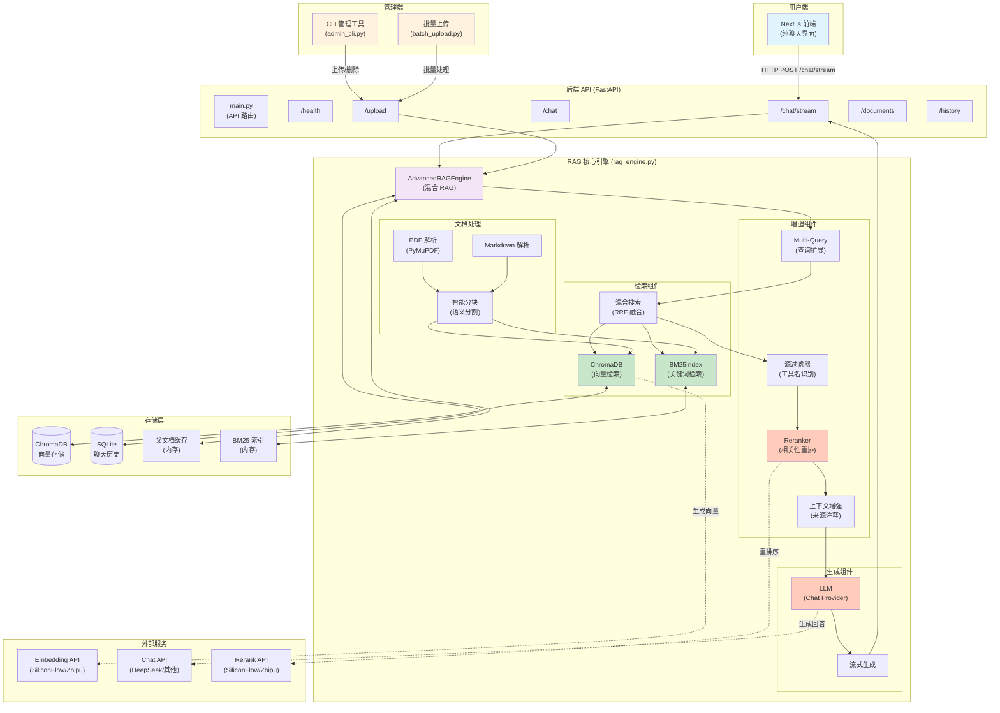

# RAG 系统架构分析

## 系统概述

这是一个基于 **混合检索增强生成 (Hybrid RAG)** 的智能知识库系统，专为数字后端 EDA 工具设计。系统采用管理员-用户分离架构，管理员通过 CLI 管理文档，用户通过 Web 界面纯聊天查询。

## 技术栈

### 后端
- **FastAPI**: Web 框架
- **LangChain**: LLM 应用开发框架
- **ChromaDB**: 向量数据库
- **BM25Okapi**: 关键词检索
- **SQLite**: 聊天历史存储

### 前端
- **Next.js 14**: React 框架 (App Router)
- **TypeScript**: 类型安全
- **Tailwind CSS**: 样式框架

### AI 服务
- **Chat Provider**: DeepSeek / OpenAI / SiliconFlow / Zhipu
- **Embedding Provider**: SiliconFlow / Zhipu
- **Reranker**: SiliconFlow (bge-reranker-v2-m3) / Zhipu (embedding-rank)

---

## 系统整体架构




---

## 查询流程详解

```mermaid
flowchart TD
    Start([用户提问]) --> CreateConv{创建/获取<br/>会话 ID}
    CreateConv --> SaveUser["保存用户消息<br/>到 SQLite"]
    
    SaveUser --> Step0["步骤 0: Multi-Query 生成<br/>使用 LLM 从 3 个角度改写查询"]
    
    Step0 --> GenQueries["生成查询变体:<br/>1. 技术术语扩展<br/>2. 问题类型转换<br/>3. 上下文补充"]
    
    GenQueries --> Step1["步骤 1: 混合检索<br/>并行执行 Vector + BM25"]
    
    Step1 --> VectorSearch["向量检索<br/>(ChromaDB)<br/>语义相似度"]
    Step1 --> BM25Search["BM25 检索<br/>(关键词匹配)<br/>jieba 分词"]
    
    VectorSearch --> RRF["Reciprocal Rank Fusion<br/>融合排序<br/>score = 1/(60+rank)"]
    BM25Search --> RRF
    
    RRF --> Dedupe["去重合并<br/>生成候选文档列表"]
    
    Dedupe --> Step1_5["步骤 1.5: 源过滤器<br/>识别工具名并优先排序"]
    
    Step1_5 --> ToolDetect{"检测问题中的<br/>工具名?<br/>(FC/PT/ICC2/DC)"}
    
    ToolDetect -->|"检测到"| Prioritize["优先返回匹配工具的文档<br/>例: 问 FC → 优先 FC 文档"]
    ToolDetect -->|"未检测到"| KeepAll["保留所有文档"]
    
    Prioritize --> Step2
    KeepAll --> Step2
    
    Step2["步骤 2: 重排序 (Rerank)"]
    
    Step2 --> RerankCheck{Rerank<br/>启用?}
    
    RerankCheck -->|"是"| CallRerank["调用 Rerank API<br/>(Cross-Encoder 模型)<br/>精确相关性打分"]
    RerankCheck -->|"否"| TopN["直接取前 N 个"]
    
    CallRerank --> Top5["返回 Top-5 文档"]
    TopN --> Top5
    
    Top5 --> Step3["步骤 3: 上下文增强"]
    
    Step3 --> EnrichMeta["为每个文档添加:<br/>- 来源文件名<br/>- 章节信息<br/>- 排名标识<br/>- 截断长文本"]
    
    EnrichMeta --> BuildContext["构建上下文字符串<br/>(参考1, 参考2, ...)"]
    
    BuildContext --> YieldMeta["推送元数据<br/>给前端显示来源"]
    
    YieldMeta --> Step4["步骤 4: LLM 生成回答"]
    
    Step4 --> SystemPrompt["构建系统提示词:<br/>- 严格基于参考资料<br/>- 标注来源 [N]<br/>- 自然专家语气<br/>- 结构化回答"]
    
    SystemPrompt --> StreamLLM["流式调用 LLM<br/>(逐 Token 生成)"]
    
    StreamLLM --> YieldContent["实时推送内容块<br/>给前端渲染"]
    
    YieldContent --> Complete{生成<br/>完成?}
    
    Complete -->|"否"| StreamLLM
    Complete -->|"是"| SaveAssist["保存助手消息<br/>到 SQLite (含来源)"]
    
    SaveAssist --> CacheMemory["缓存到内存<br/>(会话历史)"]
    
    CacheMemory --> End([返回完整回答])
    
    style Start fill:#4caf50,color:#fff
    style End fill:#4caf50,color:#fff
    style Step0 fill:#2196f3,color:#fff
    style Step1 fill:#2196f3,color:#fff
    style Step1_5 fill:#ff9800,color:#fff
    style Step2 fill:#2196f3,color:#fff
    style Step3 fill:#2196f3,color:#fff
    style Step4 fill:#2196f3,color:#fff
    style RRF fill:#9c27b0,color:#fff
    style CallRerank fill:#e91e63,color:#fff
    style StreamLLM fill:#f44336,color:#fff
```



---

## 核心技术特性

### 1. **混合检索 (Hybrid Search)**
- **Vector Search**: 使用 Embedding 模型将查询和文档转为向量，计算语义相似度
- **BM25 Search**: 基于 jieba 中文分词的关键词检索，捕捉精确匹配
- **RRF 融合**: Reciprocal Rank Fusion 算法融合两种检索结果，公式: `score = 1/(60 + rank)`

### 2. **Multi-Query 扩展**
- 使用 LLM 从 3 个角度改写查询：
  1. **技术术语角度**: 扩展缩写 (FC → Fusion Compiler)
  2. **问题类型角度**: 转换为 How-to/What-is/Why 形式
  3. **上下文角度**: 补充场景和前提条件
- 可提高检索召回率，覆盖不同表达方式

### 3. **源过滤器 (Source Filter)**
- 识别问题中提到的工具名 (FC/PT/ICC2/DC)
- 优先返回对应工具的文档
- 解决"问 FC 却引用 PT 文档"的问题

### 4. **Cross-Encoder 重排序**
- 使用 `BAAI/bge-reranker-v2-m3` 或 `embedding-rank` 模型
- 对候选文档进行精确的相关性打分
- 从 20 个候选中筛选出最相关的 5 个

### 5. **语义分块 (Semantic Chunking)**
- **Markdown**: 基于标题层级 (h1/h2/h3) 智能分块
- **PDF**: 基于页码和句子边界分块
- 保留元数据: 章节、父章节、来源文件

### 6. **流式生成 (Streaming)**
- 使用 Server-Sent Events (SSE) 实时推送回答
- 提供更好的用户体验，减少等待感知

### 7. **多 Provider 支持**
- **Chat**: DeepSeek / OpenAI / SiliconFlow / Zhipu
- **Embedding**: SiliconFlow / Zhipu
- **Rerank**: SiliconFlow / Zhipu
- 灵活配置，混合使用 (如 DeepSeek Chat + SiliconFlow Embedding)

---

## 配置参数 (`.env`)

```env
# Chat Provider
CHAT_PROVIDER=deepseek
DEEPSEEK_API_KEY=sk-xxx
DEEPSEEK_API_BASE=https://api.deepseek.com/v1
DEEPSEEK_MODEL=deepseek-chat

# Embedding Provider
EMBEDDING_PROVIDER=siliconflow
SILICONFLOW_API_KEY=sk-xxx
SILICONFLOW_API_BASE=https://api.siliconflow.cn/v1
SILICONFLOW_EMBEDDING_MODEL=BAAI/bge-m3

# RAG 参数
RERANK_ENABLED=true
SILICONFLOW_RERANK_MODEL=BAAI/bge-reranker-v2-m3
RETRIEVAL_TOP_K=20          # 混合检索返回前 20 个候选
RERANK_TOP_N=5              # 重排序后取前 5 个
CHUNK_SIZE=500              # 分块大小
CHUNK_OVERLAP=100           # 分块重叠
```

---

## API 端点

| 端点                         | 方法   | 功能                    | 权限   |
| ---------------------------- | ------ | ----------------------- | ------ |
| `/health`                    | GET    | 健康检查                | 公开   |
| `/upload`                    | POST   | 上传文档 (PDF/MD)       | 管理员 |
| `/chat`                      | POST   | 同步查询 (返回完整回答) | 用户   |
| `/chat/stream`               | POST   | 流式查询 (SSE)          | 用户   |
| `/documents`                 | GET    | 列出所有文档            | 管理员 |
| `/documents/{filename}`      | DELETE | 删除文档                | 管理员 |
| `/history`                   | GET    | 获取聊天历史列表        | 用户   |
| `/history/{conversation_id}` | GET    | 获取对话消息            | 用户   |
| `/history/{conversation_id}` | DELETE | 删除对话                | 用户   |

---

## 数据流示例

### 上传文档流程
```
管理员 → CLI upload example.pdf
  ↓
FastAPI /upload
  ↓
rag_engine.ingest_document()
  ↓
1. 解析 PDF (PyMuPDF)
2. 智能分块 (RecursiveCharacterTextSplitter)
3. 生成向量 (Embedding API)
4. 存入 ChromaDB
5. 构建 BM25 索引
  ↓
返回: "上传成功, 创建 42 个分块"
```

### 用户查询流程
```
用户输入: "FC 中如何优化 timing?"
  ↓
Multi-Query 生成:
  Q1: "Fusion Compiler timing optimization 时序优化"
  Q2: "How to improve timing in FC?"
  Q3: "FC 中 setup/hold violation 如何修复"
  ↓
混合检索 (每个查询):
  - Vector: 基于语义检索 FC timing 相关文档
  - BM25: 关键词匹配 "FC" "timing" "优化"
  - RRF 融合: 合并 6 个查询结果 (去重)
  ↓
源过滤:
  检测到 "FC" → 优先 FC 文档,降级 PT/ICC2 文档
  ↓
Rerank:
  使用 Cross-Encoder 对 20 个候选重新打分,取 Top-5
  ↓
上下文增强:
  [参考1 | 来源: FC_User_Guide.pdf | 章节: Timing Optimization]
  内容...
  [参考2 | 来源: FC_Command_Reference.pdf | 章节: optimize_timing]
  内容...
  ↓
LLM 生成:
  系统提示: "基于以下参考资料回答,标注来源..."
  流式输出: "FC 中优化 timing 的方法包括:\n\n### 1. CTS 优化..."
  ↓
返回前端: 
  - 回答文本 (流式)
  - 来源列表 (metadata)
```

---

## 优势对比

| 特性            | 传统 RAG      | 当前系统                  |
| --------------- | ------------- | ------------------------- |
| 检索方式        | 仅向量检索    | 混合检索 (Vector + BM25)  |
| 查询扩展        | 无            | Multi-Query 生成 3 个变体 |
| 重排序          | 无/Bi-Encoder | Cross-Encoder (更精确)    |
| 来源准确性      | 语义混淆      | 源过滤器 + 工具名识别     |
| 分块策略        | 固定大小      | 语义分块 (按标题/页面)    |
| 响应方式        | 同步等待      | 流式生成                  |
| Provider 灵活性 | 单一          | 多 Provider 混合使用      |

---

## 系统优化建议

1. **查询理解增强**
   - 添加意图识别 (查概念 vs 查步骤 vs 排错)
   - 针对不同意图调整检索策略

2. **缓存机制**
   - 对常见问题缓存回答
   - 对已计算过的向量缓存

3. **用户反馈循环**
   - 添加"有帮助/无帮助"按钮
   - 收集负反馈用于优化检索参数

4. **访问控制**
   - 添加用户认证 (JWT)
   - 区分管理员和普通用户权限

5. **监控指标**
   - 检索召回率、准确率
   - 平均响应时间
   - Rerank 效果分析

---

## 总结

这是一个 **生产级的混合 RAG 系统**，相比基础 RAG 有显著提升：

- ✅ **检索更全面**: Vector + BM25 双引擎
- ✅ **查询更智能**: Multi-Query 扩展覆盖多种表达
- ✅ **结果更准确**: Cross-Encoder 重排序 + 源过滤器
- ✅ **回答更可靠**: 严格基于参考资料,标注来源
- ✅ **体验更流畅**: 流式生成,实时推送
- ✅ **架构更灵活**: 多 Provider 支持,易于切换

特别适用于 **专业领域知识库** (如 EDA/芯片设计),能有效解决传统 RAG 在工具文档混淆、检索不准确等问题。
