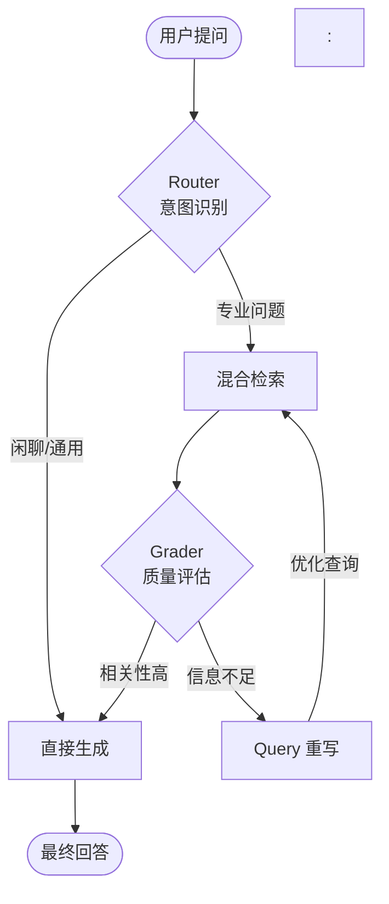

# RAG 知识库系统优化报告 (RAG System Optimization Report)

**项目名称**: EDA 知识库 RAG 系统  
**优化目标**: 打造具备 Agentic 能力的专家级 EDA 问答系统  
**核心升级**: 
1. **Agentic Workflow**: 引入智能路由与自我修正闭环。
2. **Structural Optimization**: 重构 PDF 处理流程，解决上下文重叠与 Token 消耗问题。
**最后更新**: 2026-02-13

---

## 一、Agentic RAG 智能工作流 (Agentic Workflow)

这是系统的大脑升级，从传统的线性 RAG（检索-生成）升级为了具备**思考与修正能力**的智能体。系统不再盲目回答，而是能够判断问题类型、评估检索质量，并在必要时自动修正查询。

### 1.1 核心闭环 (The Loop)

引入了闭环控制系统，包含四个关键节点：**Router (路由)** -> **Retrieve (检索)** -> **Grade (评估)** -> **Rewrite (重写)** -> **Generate (生成)**。

### 1.2 关键组件

1.  **智能路由 (Router)**：区分闲聊（直接回答）和专业问题（RAG 检索），提高响应速度与准确性。
2.  **自我修正 (Self-Correction)**：
    -   **Grader**：严格评估检索文档的相关性，拒绝“垃圾输入”。
    -   **Rewriter**：当检索结果不佳时，自动重写查询（例如补充 EDA 术语），实现多轮迭代检索。

---

## 二、数据处理与架构重构 (Architecture & Data Processing) - **[CORE UPGRADE]**

针对 EDA 文档（主要为 PDF 手册）的特性，我们彻底重构了数据预处理流程，解决了“上下文切割”和“Token 爆炸”两大痛点。

### 2.1 基于语义的严格切分 (Strict Semantic Slicing)

我们摒弃了传统的“按页切分 (Page-based)”模式，采用了更符合人类阅读逻辑的“按章节切分 (TOC-based)”。

-   **TOC 提取与定位**：
    -   使用 `fitz` (PyMuPDF) 深度解析 PDF 的目录树 (Table of Contents)。
    -   精确计算每个章节的 `Start Page` 和 `End Page`。
-   **Regex Truncation (正则截断)**：
    -   **问题**：PDF 的章节结束位置往往不在页末，简单的按页提取会将下一章的标题和开头误包含在当前章内，导致检索混乱。
    -   **方案**：在内存处理阶段，使用正则表达式 `r'\n(#+)\s+' + re.escape(next_title)` 动态定位下一章标题在文本中的位置，并在此处**精准截断**。
    -   **效果**：确保了每个 Chunk 的语义纯净性，杜绝了上下文污染。
-   **全内存流式处理**：
    -   整个清洗、切分、注入 ID 的过程完全在 RAM 中完成，不产生临时琐碎文件，效率提升显著。

### 2.2 父文档扩展与去重 (Parent Expansion & Deduplication)

为了平衡检索精度（需要小切片）和回答完整性（需要大上下文），我们实施了 **"Index Child, Retrieve Parent"** 策略，并配合严格的 Token 控制。

1.  **双层索引结构**：
    -   **Parent Chunk**: 完整保存一个章节的内容（可能长达数千字），存储在 `parent_docs.json` 中。
    -   **Child Chunk**: 将 Parent 切分为小片段（300-500字）用于向量检索，每个 Child 携带 `parent_id` 指针。

2.  **Parent ID 注入**：
    -   格式：`{filename}::{Hierarchy_Path}` (例如 `ug.pdf::Usage > App Options`).
    -   作用：唯一标识 content source，作为去重的核心依据。

3.  **智能扩展逻辑 (Expansion Logic)**：
    -   **Deduplication (去重)**：当多个 Child Chunks 指向同一个 Parent 时，系统在扩展阶段会自动去重，**只召回一次**该父文档。
    -   **Max Count Limit**: 强制限制单次 RAG 流程最多召回 **8 个** 父文档 (`MAX_PARENT_COUNT = 8`)。
    -   **Sliding Window (滑动窗口)**：
        -   对于超大章节（长度 > 8000 字符），不再召回全文（避免撑爆 LLM 窗口）。
        -   **算法**：以命中的 Child Chunk 为中心，动态截取前后 **2000 字符** (`WINDOW_SIZE`)。
        -   **收益**：将最坏情况下的 Token 消耗从无上限降低至可控的 **~8k Tokens** 范围内。

### 2.3 来源精准消歧 (Source Disambiguation)

-   **问题**：Fusion Compiler (FC) 和 PrimeTime (PT) 有大量同名命令（如 `report_timing`），导致 RAG 混淆。
-   **策略**：
    -   **Strict Filtering**: 遇到明确工具意图的 Queries，强制压低非目标工具文档的权重。
    -   **Context Role Tagging**: 在 Prompt 中明确注入 `[工具: Fusion Compiler | 主要来源]` 标签，指导 LLM 区分主次。

---

## 三、混合检索策略 (Hybrid Search Strategy)

针对 EDA 领域术语多、命令复杂的特点，采用了 Vector + BM25 的混合检索。

### 3.1 动态权重 (Dynamic Weights)
通过 `.env`配置，根据查询类型动态调整权重：
-   **命令查询** (e.g., `set_app_options`): **BM25 > Vector** (0.7 vs 0.3)，优先精确匹配。
-   **概念查询** (e.g., "How to fix hold time"): **Vector > BM25** (0.6 vs 0.4)，优先语义理解。

### 3.2 专用术语词典 (EDA Lexicon)
-   **痛点**：普通分词器会将 `set_placement_ir_drop_target` 切碎。
-   **解决**：自动化提取 PDF 中的高频术语（**12,000+** 候选），生成 `eda_terms.txt` 并加载到 Jieba 分词器中，确保专业术语不被拆分。

---

## 四、性能收益 (Performance Gains)

| 指标 (Metric)               | 优化前 (Legacy)      | 优化后 (Current)          | 收益 (Gain)            |
| :-------------------------- | :------------------- | :------------------------ | :--------------------- |
| **检索精准度 (Precision)**  | 中 (Context Overlap) | **高** (Strict Slicing)   | ✅ 语义独立，无噪声干扰 |
| **Token 消耗 (Worst Case)** | ~18k (无上限)        | **~7.7k** (Max 8 Parents) | 📉 **节省 57%**         |
| **处理效率 (Throughput)**   | I/O 密集型           | **内存密集型**            | 🚀 减少磁盘读写         |
| **长尾问题解决率**          | 低 (单次检索)        | **高** (Agentic Rewrite)  | 🔄 自动修正错误查询     |

---

## 五、生成与 Prompt 工程 (Prompt Engineering)

### 5.1 "专家级" System Prompt
- **角色设定**：从通用助手转变为 **“EDA 技术专家”**。
- **来源区分指令**：明确告知 LLM “当用户问 A 工具时，以 A 文档为准，B 工具信息仅作对比”。
- **术语保护**：强制保留 Flow、Command、Parameter 的英文原文，**严禁意译**（如 `High Effort Congestion Flow`）。

### 5.2 风格规范
- **禁止废话**：去掉 "根据参考文档..." 等机械开头。
- **结构化输出**：强制要求按 "分类整理 -> 详细说明 -> 总结" 的结构回答。

---

## 六、前端体验优化 (Frontend)

- **流式交互修复**：修复了 `useEffect` 导致的流式消息丢失问题，添加 `isStreaming` 锁。
- **样式优化**：修复了表格列宽问题，优化了 Markdown 渲染的一致性。

---

## 七、验证与测试 (Verification)

### 7.1 验证工具
- 开发了自动化验证脚本 `verify_rag_strategy.py`，用于直接测试 RAG 引擎的检索与生成逻辑。

### 7.2 典型用例测试结果
| 测试场景         | 测试问题                                           | 结果                       |
| :--------------- | :------------------------------------------------- | :------------------------- |
| **Agentic 路由** | "你好"                                             | ✅ 不检索，直接回复         |
| **来源消歧**     | "FC中有哪些改善congestion的手段"                   | ✅ 仅主要引用 FC 文档       |
| **概念区分**     | "FC中的constant propagation和case propagation区别" | ✅ 区分 FC 与 PT 概念       |
| **Parent 扩展**  | "User Guide 相关内容"                              | ✅ 成功召回完整章节，无截断 |

---

## 八、总结与展望 (Conclusion)

本次优化通过引入 **Agentic Workflow** 和 **Strict Semantic Slicing**，将系统升级为具备主动思考和精准检索能力的专家系统。特别是在 **Token 成本** 和 **上下文质量** 之间取得了完美的平衡。

### 后续规划
1.  **多模态支持**：探索 PDF 表格和图片的解析与索引。
2.  **用户反馈闭环**：建立点赞/点踩机制，收集 Bad Case。
3.  **增量更新优化**：完善文件哈希对比，实现秒级增量更新。
