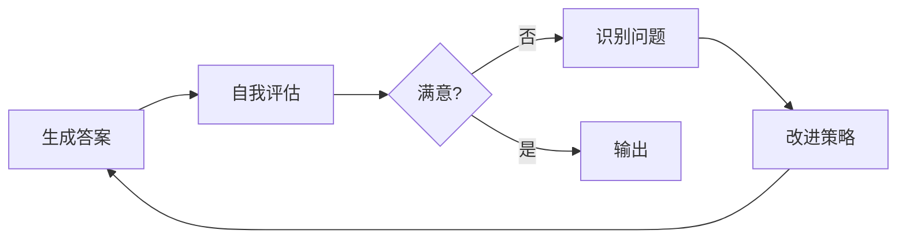
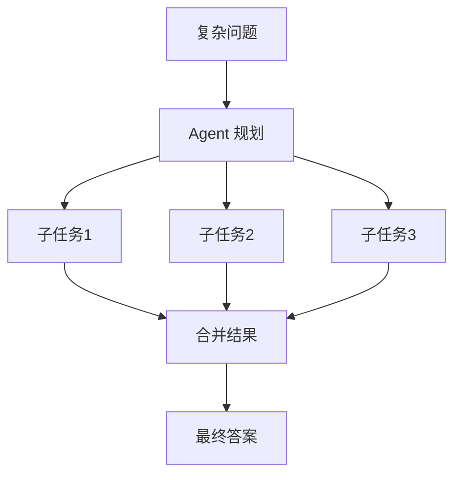
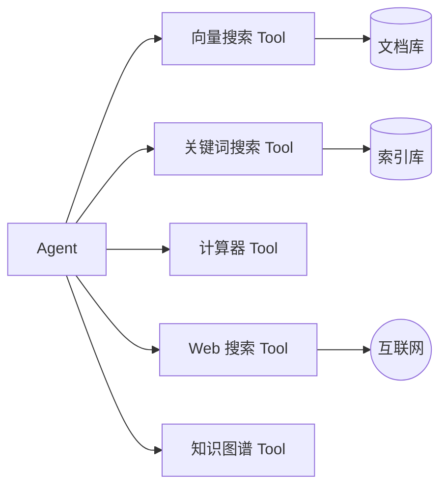
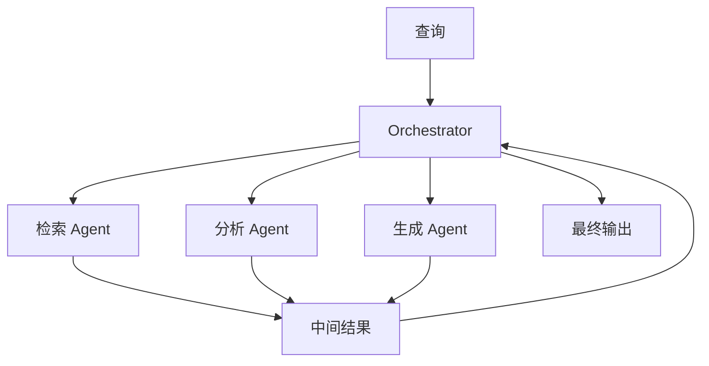

# Agentic RAG 深度调研报告

> 基于 [AgenticRAG-Survey](https://github.com/asinghcsu/AgenticRAG-Survey) 及相关论文的系统性分析
> 调研日期: 2026-02-05

---

## 1. 核心概念：什么是 Agentic RAG？

### 1.1 与传统 RAG 的本质区别

| 维度         | 传统 RAG               | Agentic RAG                         |
| ------------ | ---------------------- | ----------------------------------- |
| **控制流**   | 程序预定义的固定流程   | LLM Agent 自主决策                  |
| **检索机制** | 必然发生的单次检索     | 检索是 Tool，Agent 决定是否调用     |
| **推理能力** | 单步生成               | 多步推理、自我修正                  |
| **适应性**   | 静态，无法根据结果调整 | 动态适应，根据中间结果调整策略      |
| **工具使用** | 无                     | 可调用多种工具（搜索、计算、API等） |

### 1.2 核心理念

> **Agentic RAG = 把 RAG 的检索能力包装成 Tool，由 LLM Agent 自主决定何时调用、如何调用**

传统 RAG 是"传声筒"——机械地执行 `Query → Retrieve → Generate`。

Agentic RAG 是"聪明的调查员"——**自主决策**是否需要检索、**查询规划**将复杂问题拆解、**自我修正**根据结果调整策略。

---

## 2. 四大 Agentic Patterns（Agent 能力模式）

这是 Agentic RAG 系统的核心能力基石：

### 2.1 🔄 Reflection（反思模式）



- **定义**：Agent 评估自己的决策和输出，识别错误并改进
- **关键价值**：
  - 迭代优化结果
  - 提升多步推理的准确性
- **应用示例**：医疗诊断系统根据检索数据反复优化诊断结论

### 2.2 📋 Planning（规划模式）



- **定义**：Agent 创建结构化的任务序列来解决问题
- **关键价值**：
  - 将复杂任务分解为可管理的子任务
  - 优化任务优先级，减少计算开销
- **应用示例**：金融分析系统规划数据检索任务以评估风险

### 2.3 🔧 Tool Use（工具使用模式）



- **定义**：Agent 与外部工具、API、知识库交互
- **关键价值**：
  - 扩展系统能力超越预训练知识
  - 通过集成外部资源实现领域特定应用
- **应用示例**：法律助手从合同数据库检索条款并应用合规规则

### 2.4 🤝 Multi-Agent Collaboration（多 Agent 协作模式）



- **定义**：多个 Agent 协作分工完成复杂任务
- **关键价值**：
  - 高效处理大规模分布式问题
  - 结合专业化 Agent 能力获得更好结果
- **应用示例**：客服系统中多个 Agent 协作检索 FAQ、生成回复、提供后续跟进

---

## 3. 五大 Workflow Patterns（工作流模式）

来源: [Anthropic Research](https://www.anthropic.com/research/building-effective-agents)

### 3.1 Prompt Chaining（提示链）

```
[Task] → [Step 1] → [Step 2] → [Step 3] → [Result]
```

- **适用场景**：可分解为固定子任务的复杂任务
- **优点**：每步简化提升准确率
- **缺点**：顺序处理增加延迟

### 3.2 Routing（路由）

```
[Input] → [Classifier] → Route A → [Handler A]
                      → Route B → [Handler B]
                      → Route C → [Handler C]
```

- **适用场景**：不同类型输入需要不同处理策略
- **示例**：
  - 将客服查询分类到技术支持/退款/一般咨询
  - 简单问题用小模型，复杂问题用大模型

### 3.3 Parallelization（并行化）

```
              → [Process A] →
[Input] → Split              → Merge → [Output]
              → [Process B] →
```

- **两种形式**：
  - **Sectioning**：任务拆分成独立子任务
  - **Voting**：多输出交叉验证提升准确率
- **适用场景**：独立子任务、需要高可信度输出

### 3.4 Orchestrator-Workers（编排-执行）

```
[Orchestrator] → Analyze → Delegate → [Worker 1]
                                   → [Worker 2]
                                   → [Worker N]
                        ← Compile Results ←
```

- **核心特点**：动态任务分解，实时适应
- **与 Parallelization 区别**：子任务不是预定义的
- **适用场景**：复杂度不确定的任务

### 3.5 Evaluator-Optimizer（评估-优化）

```
[Generate] → [Evaluate] → [满意?] → No → [Refine] → [Generate]
                              ↓ Yes
                          [Output]
```

- **适用场景**：迭代改进能显著提升质量的任务
- **示例**：翻译多轮优化、搜索结果多轮精炼

---

## 4. Agentic RAG 系统分类法（Taxonomy）

### 4.1 完整分类体系

| 类型             | 核心思想                   | 优势               | 局限             | 适用场景         |
| ---------------- | -------------------------- | ------------------ | ---------------- | ---------------- |
| **Single-Agent** | 单个Agent管理检索和生成    | 架构简单，易实现   | 可扩展性有限     | 简单QA任务       |
| **Multi-Agent**  | 多Agent协作分工            | 模块化，可扩展     | 协调复杂度高     | 复杂多步任务     |
| **Hierarchical** | 层级结构，顶层编排底层执行 | 任务优先级清晰     | 高层可能成瓶颈   | 大规模复杂任务   |
| **Corrective**   | 反馈循环迭代优化输出       | 高准确性           | 计算开销大       | 高准确性要求任务 |
| **Adaptive**     | 动态调整检索策略           | 高灵活性           | 设计复杂         | 动态环境任务     |
| **Graph-Based**  | 集成知识图谱增强推理       | 多跳推理能力强     | 需要构建知识图谱 | 关系密集型任务   |
| **ADW**          | 文档中心工作流             | 状态维护，领域适应 | 企业级复杂度     | 合同/发票处理    |

### 4.2 各类型详细说明

#### Single-Agent RAG
```
Query → Agent → Retrieve → Process → Response
```
最基础形式，适合入门和简单场景。

#### Multi-Agent RAG (推荐关注)
```
Query → [Retrieval Agent] → [Reasoning Agent] → [Synthesis Agent] → Response
```
- **AgentFlow 案例**：Planner + Executor + Verifier + Generator 四模块协作
- 支持多工具：`python_coder`, `google_search`, `wikipedia_search`, `web_search`

#### Corrective Agentic RAG (推荐关注)
```
Generate → Critic评估 → [不满意] → 修正 → 重新生成
                     → [满意] → 输出
```
- 关键组件：**Critic Module**
- 避免无限循环需要设置最大迭代次数和质量阈值

#### Adaptive Agentic RAG (推荐关注)
```
Query → 上下文评估 → 动态选择检索策略 → 执行 → 综合响应
```
- 根据问题类型动态选择：向量搜索 / 关键词搜索 / 混合搜索 / 跳过检索

---

## 5. 与你现有系统的对比分析

### 5.1 你当前系统已有能力

| 能力                     | 实现状态 | Agentic RAG 对应 |
| ------------------------ | -------- | ---------------- |
| 混合搜索 (Vector + BM25) | ✅ 已实现 | Tool Use 的基础  |
| Rerank 重排序            | ✅ 已实现 | 可作为 Tool      |
| Multi-Query 多查询       | ✅ 已实现 | Planning 的雏形  |
| 来源过滤                 | ✅ 已实现 | Routing 的雏形   |
| 语义分块                 | ✅ 已实现 | 基础设施         |

### 5.2 缺失的 Agentic 能力

| 能力                | 当前状态   | 改进方向                | 优先级 |
| ------------------- | ---------- | ----------------------- | ------ |
| **检索作为 Tool**   | ❌ 固定流程 | 包装成 function calling | ⭐⭐⭐⭐⭐  |
| **Agent 自主决策**  | ❌ 程序控制 | LLM 决定是否检索        | ⭐⭐⭐⭐⭐  |
| **Reflection 反思** | ❌ 无       | 评估检索结果相关性      | ⭐⭐⭐⭐   |
| **Critic 批判**     | ❌ 无       | 评估答案质量            | ⭐⭐⭐    |
| **迭代修正**        | ❌ 单次检索 | 支持多轮检索            | ⭐⭐⭐⭐   |
| **Routing 路由**    | 🔶 部分     | 根据问题类型选策略      | ⭐⭐⭐    |

---

## 6. 推荐实施方案

### 6.1 方案一：Adaptive Single-Agent RAG（推荐首选）

**核心改造**：把你现有的 RAG 流程改造成 Agent + Tools 架构

```python
# 伪代码示意
tools = [
    VectorSearchTool(vectorstore),      # 向量搜索
    KeywordSearchTool(bm25_index),       # 关键词搜索
    HybridSearchTool(vectorstore, bm25), # 混合搜索
    SummaryTool(),                        # 文档摘要
]

agent = ReActAgent(
    llm=your_llm,
    tools=tools,
    system_prompt=AGENTIC_PROMPT
)

# Agent 自主决策
response = agent.chat("FC 中如何解决 congestion？")
```

**优势**：
- 改造成本最低（复用现有检索能力）
- 效果提升明显
- 延迟增加可控

### 6.2 方案二：Corrective Agentic RAG

**核心改造**：添加 Grader + 迭代循环

```python
async def query_corrective(question):
    for iteration in range(MAX_ITERATIONS):
        # 检索
        docs = hybrid_search(question)
        
        # Grader 评估
        relevant_docs = await grader.filter(question, docs)
        
        if len(relevant_docs) >= threshold:
            break
        
        # 重写查询重试
        question = await rewrite_query(question)
    
    # 生成答案
    answer = await generate(question, relevant_docs)
    
    # Critic 评估（可选）
    if await critic.needs_revision(answer):
        answer = await regenerate(question, relevant_docs)
    
    return answer
```

**优势**：
- 显著提升答案准确性
- 减少"检索不相关"的问题

### 6.3 方案三：完整 Agentic RAG（长期目标）

**全功能实现**：
- Agent 核心 + 多 Tool + Routing + Reflection + Critic
- 支持多轮对话状态维护
- 可扩展到多 Agent 协作

---

## 7. 实施建议与讨论点

### 7.1 推荐实施路径

```
阶段1：Tool化改造（1-2天）
├── 将 vector_search、bm25_search 包装成 FunctionTool
├── 实现基础 ReAct Agent
└── 验证 Agent 自主调用 Tool 的效果

阶段2：添加 Grader（1天）
├── 实现检索结果相关性评估
├── 低相关性触发重新检索
└── 设置最大迭代次数防止死循环

阶段3：添加 Routing（0.5天）
├── 根据问题类型选择最优检索策略
└── 简单问题跳过检索直接回答

阶段4：添加 Critic（可选）
├── 答案质量评估
└── 低质量答案触发重生成
```

### 7.2 需要讨论的问题

> [!IMPORTANT]
> **请回复你的想法，我们一起确定最适合的方案**

1. **延迟容忍度**：Agentic RAG 会增加 LLM 调用次数，你能接受多少延迟增加？
   - 当前单次查询约 2-5 秒
   - Agentic 可能增加到 5-15 秒

2. **API 成本**：每次查询可能需要 2-5 次 LLM 调用，成本增加 2-5 倍，可接受吗？

3. **优先解决的问题**：
   - A) 检索结果不相关 → 需要 Grader
   - B) 答案质量不高 → 需要 Critic
   - C) 复杂问题处理不好 → 需要 Planning
   - D) 以上全部

4. **技术栈选择**：
   - A) 纯手写实现（完全控制，但工作量大）
   - B) 使用 LlamaIndex Agent（成熟框架，快速实现）
   - C) 使用 LangChain/LangGraph（功能丰富，学习曲线陡）

---

## 8. 参考资源

### 开源实现

| 项目                        | 描述                | 链接                                                                                                                            |
| --------------------------- | ------------------- | ------------------------------------------------------------------------------------------------------------------------------- |
| AgenticRAG-Survey           | 本次调研主源        | [GitHub](https://github.com/asinghcsu/AgenticRAG-Survey)                                                                        |
| Agentic-RAG-with-LlamaIndex | LlamaIndex 完整实现 | [GitHub](https://github.com/PatrickAttankurugu/Agentic-RAG-with-LlamaIndex)                                                     |
| NVIDIA Agentic RAG          | 企业级实现          | [GitHub](https://github.com/NVIDIA/workbench-example-agentic-rag)                                                               |
| Azure GPT RAG Agentic       | Azure 集成          | [GitHub](https://github.com/Azure/gpt-rag-agentic)                                                                              |
| Corrective RAG Notebook     | CRAG 实现示例       | [Colab](https://colab.research.google.com/github/athina-ai/rag-cookbooks/blob/main/agentic_rag_techniques/corrective_rag.ipynb) |
| Adaptive RAG Notebook       | 自适应 RAG 示例     | [Colab](https://colab.research.google.com/github/athina-ai/rag-cookbooks/blob/main/agentic_rag_techniques/adaptive_rag.ipynb)   |

### 论文

- [Agentic RAG Survey Paper](https://arxiv.org/pdf/2501.09136) - 系统性综述
- [Self-RAG](https://arxiv.org/abs/2310.11511) - 自我反思 RAG
- [Corrective RAG](https://arxiv.org/abs/2401.15884) - 纠错 RAG

---

## 9. 总结

Agentic RAG 的核心变革是**从程序控制转向 LLM 自主决策**。你的直觉完全正确——它不是简单优化传统 RAG 流程，而是彻底改变架构：

1. **检索变成 Tool** - LLM 决定何时调用
2. **LLM 成为 Agent** - 自主规划和执行
3. **支持多轮迭代** - 反思和修正
4. **动态适应** - 根据问题类型选择策略

对于你的 EDA 知识库系统，我建议从 **Adaptive Single-Agent RAG** 开始，这能以最小改动获得最大提升。
